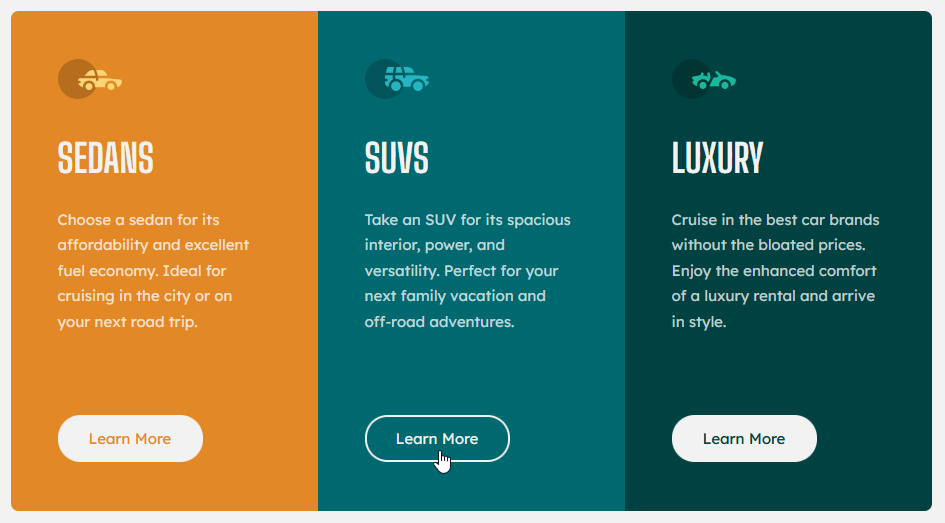

# Frontend Mentor - 3-column preview card component solution

This is a solution to the [3-column preview card component challenge on Frontend Mentor](https://www.frontendmentor.io/challenges/3column-preview-card-component-pH92eAR2-). Frontend Mentor challenges help you improve your coding skills by building realistic projects. 

### Screenshot




### Built with

- Flexbox
- Media Queries
- JavaScript DOM

### What I learned

- Using CSS Flexbox
- Using Media Queries
- Add Elements to the DOM via JavaScript


### Code snippets

```css
/* Extra small devices (phones, 950px and down) */
@media only screen and (max-width: 950px) {
  /* ... */
}
```